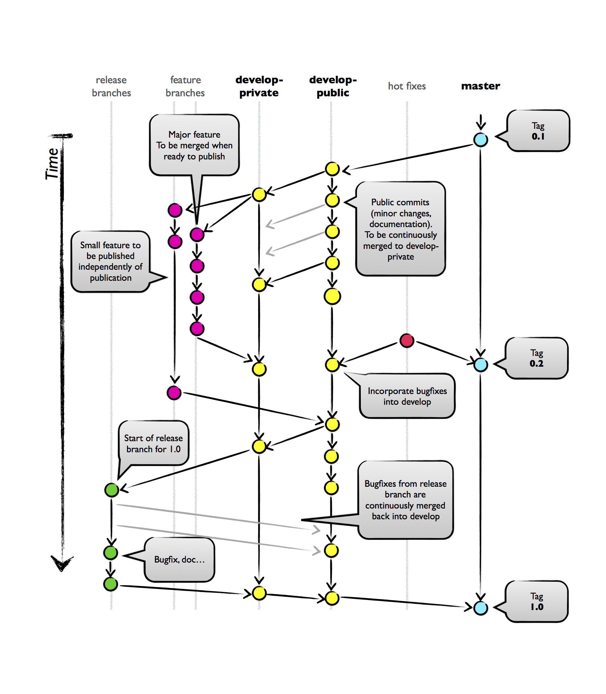

PTools branching model
======================

PTools is a science open-source project.
Developers have to deal with two contradictory issues.
On one hand, it's important that the repository looks active to the public to
make it clear that PTools's development is not on hold.
On the other hand, some features have to be private until they are published.

For those reasons, there are two PTools repositories.

``ptools/ptools`` is the public repository.
It contains two branches, namely master and develop.

``ptools/ptools-develop`` is the private repository.
The branching model is based on `Driessen's branching model`_ but accomodates
the fact that some development will be private and some will be public.

It contains all development branches, including features, bug fixes, releases,
etc.

``master`` contains releases.

``develop`` contains the work in progress for the next release.

The ``develop`` and ``master`` branches have to be linked to the public repository
so that when a branch is merged to develop, the code is directly pushed to
the public repository.

``develop-private`` contains the work in progress for the next release, just
as ``develop`` does, but includes features that will be made public only after
the work is published.
``develop`` should be continously merged into ``develop-private`` to ensure that
public changes are integrated to the private repo as soon changes are made.

Feature branches should originatd from one or the other develop branch,
depending on whether the feature will be public or private.
Quite naturally, private features will start from ``develop-private`` and be
merged back to the same branch, while small features should be added
to ``develop``.

.. _Driessen's branching model: http://nvie.com/posts/a-successful-git-branching-model/
