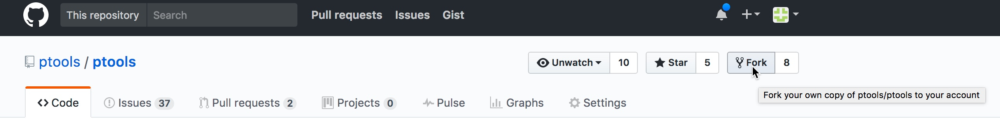

Contributing to PTools
======================

Setting up PTools repository
----------------------------

There will be different setup alternatives depending on your affiliation to
a PTools developer team.

Anyone
~~~~~~

Anyone can contribute to PTools development, even if not member of any PTools
developer team.
In this case, the basic philosophy will be to fork the `ptools` repository on
GitHub, develop your feature, and create a pull request when done.

1. Fork the `ptools` repo on GitHub: click the `Fork` button at the
   top-right of screen:

2. Clone your fork locally::

    $ git clone git@github.com:your_github_login/ptools.git

   where `your_github_login` is your github account name

Developers team
~~~~~~~~~~~~~~~

If you're part of PTools developers team, you can proceed just the same as
anyone (see above).
Importantly, your status allows you to push new branches
directly to `ptools` repository.

Futhermore, the feature you add may be more sensible and may require privacy
until publication.

.. important::
   For this is reason, it is strongly recommended to start your
   feature from `ptools private repository`_.

1. Clone the repo locally (or create a fork as decribed above but forking the
   private repo instead of the public one)::
   
    $ git clone git@github.com:ptools/ptools-develop.git

Then proceed as decribed above from step 3.

Core developers team
~~~~~~~~~~~~~~~~~~~~

If you're part of PTools core developers team, you have the privileges to
merge features in both ``develop-private`` and ``develop`` (the public
develop branch).

You need to setup the repo so that your local ``develop`` branch tracks
``ptools/ptools:develop``. This way, when you push/pull code from/to ``master``
and ``develop`` branches, it's from the public repository.

1. Clone the private repo locally::

    $ git clone git@github.com:ptools/ptools-develop.git

2. Add ``ptools/ptools`` as remote repo named `public` and track develop and
   master::

    $ cd ptools-develop
    $ git remote add -t develop -t master public git@github.com:ptools/ptools.git

3. Setup your local ``develop`` and ``master`` branches to track the one
   from the public repo::

    $ git fetch public
    $ git checkout master
    $ git branch --set-upstream-to=public/master master
    $ git checkout develop

Developping a new feature/bugfix
--------------------------------

PTools adopts a common practice in modern software development which is to
separe development into branches, named by purpose.
Thus, branches should be named in this fashion:

- ``feature/<feature_name>`` for feature development,
- ``bugfix/<issue#_or_bug_name>`` for bug fixes,
- ``release/<version#>`` for release preparation branches

To create a branch use ``git branch -b <branch_name>``, e.g.::

    $ git branch -b bugfix/issue42
    $ # alternatively, for a feature
    $ git branch -b feature/heligeom

.. _`ptools private repository`: https://github.com/ptools/ptools-develop